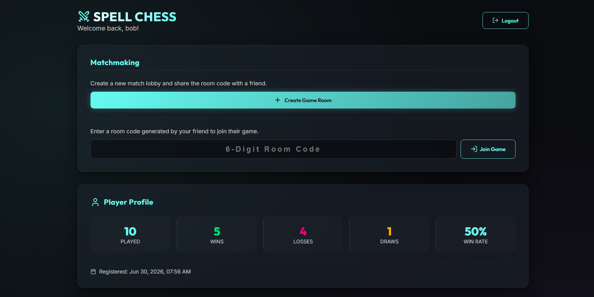
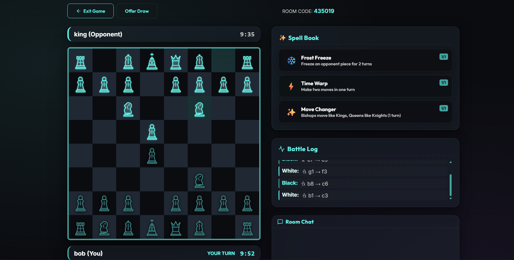

# ♟️ SpellChess — Online Multiplayer Chess with Magic

> **Real-time chess** with a twist — cast spells to freeze enemies, double your moves, and change how your pieces move. Built with React, Node.js, Socket.IO, and SQLite.

---

## 🎮 What is SpellChess?

SpellChess is a fully playable online 2-player chess game where each player has access to **3 unique spells** they can cast once per match. These spells add a strategic layer on top of traditional chess — forcing opponents to adapt in ways they never expected. You win if your opponent's king dies.

### ✨ Spells

| Spell | Effect |
|---|---|
| 🧊 **Freeze** | Click a target piece to freeze it for 2 turns. A frozen piece cannot move at all. |
| ⏩ **Time Warp** | Grants you 2 consecutive moves in a single turn. Use wisely! |
| 🔀 **Move Changer** | Your **Bishop** temporarily moves like a King, and your **Queen** moves like a Knight for this turn. |

Each spell can only be cast once per player per match — no restocking, no second chances.

---

## 🚀 Features

- **Real-time multiplayer** via Socket.IO — two players join a room by sharing a 6-digit room code
- **Full chess rules** — castling, en passant, pawn promotion, stalemate/draw detection
- **Custom spell system** — 3 unique spells per player, each with visual indicators and floating glassmorphic alerts
- **Timed matches** — configurable per-player clocks (similar to blitz chess) with auto-forfeit on timeout
- **Player authentication** — JWT-based register/login with bcrypt-hashed passwords and SQLite persistence
- **Live chat** — in-room text chat between both players
- **Battle Log** — shows the full move history of the current match


---

## 🛠️ Tech Stack

| Layer | Technology |
|---|---|
| **Frontend** | React 19, Vite 8, Vanilla CSS |
| **Real-time** | Socket.IO v4 (client + server) |
| **Backend** | Node.js, Express |
| **Auth** | JWT, bcryptjs |
| **Database** | SQLite3 (local file, no external DB needed) |
| **Security** | express-rate-limit, input regex validation, CORS |
| **Audio** | Web Audio API + Lichess standard .ogg/.mp3 assets |
| **Icons** | Lucide React |

---


---

## Local Development

### Prerequisites

- [Node.js](https://nodejs.org/) v18 or newer
- npm (comes with Node.js)

### 1. Clone the repository

```bash
git clone https://github.com/YOUR_USERNAME/SpellChess-online.git
cd SpellChess-online
```

### 2. Set up the Server

```bash
cd server
cp .env.example .env
```

Open `server/.env` and set your values:

```env
PORT=5000
JWT_SECRET=your-super-secret-key-change-this   # Use a long random string!
DB_PATH=./spellchess.db
CLIENT_ORIGIN=http://localhost:5173
```


Install dependencies and start the server:

```bash
npm install
npm start
```

The server will run on **http://localhost:5000**

### 3. Set up the Client

Open a new terminal:

```bash
cd client
cp .env.example .env
```

Open `client/.env` and verify:

```env
VITE_API_URL=http://localhost:5000/api/auth
VITE_SOCKET_URL=http://localhost:5000
```

Install dependencies and start the dev server:

```bash
npm install
npm run dev
```

The frontend will run on **http://localhost:5173**

### 4. Play!

1. Open **http://localhost:5173** in two separate browser tabs (or on two devices on the same network)
2. Register an account in each tab
3. In Tab 1: Click **Create Room** and copy the 6-digit room code
4. In Tab 2: Paste the room code into **Join Room** and click Join
5. The game starts automatically when both players are in the room


---

## 📸 Screenshots





---


## 📄 License


**Sound assets** (`client/public/sounds/`) are sourced from the [Lichess lila](https://github.com/lichess-org/lila) project and are licensed under the **AGPL-3.0 License**.

---

##  Credits

- Chess sound effects from [Lichess](https://lichess.org) (AGPL-3.0)
- Icons by [Lucide](https://lucide.dev)
- Built with [Vite](https://vitejs.dev), [React](https://react.dev), [Socket.IO](https://socket.io), and [Express](https://expressjs.com)

---


